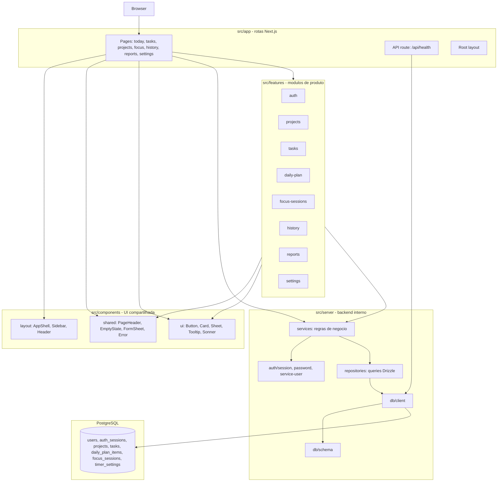
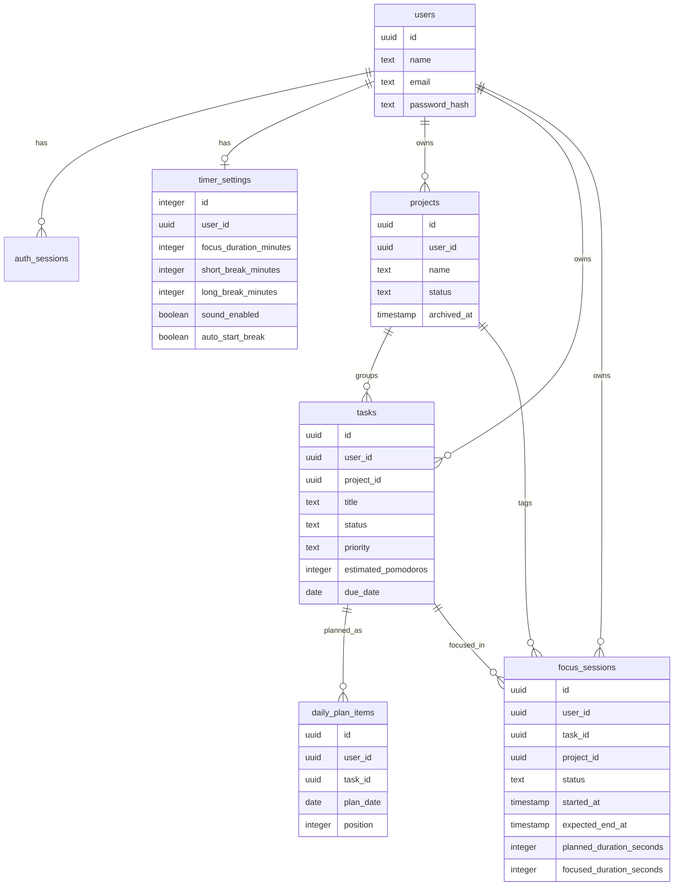
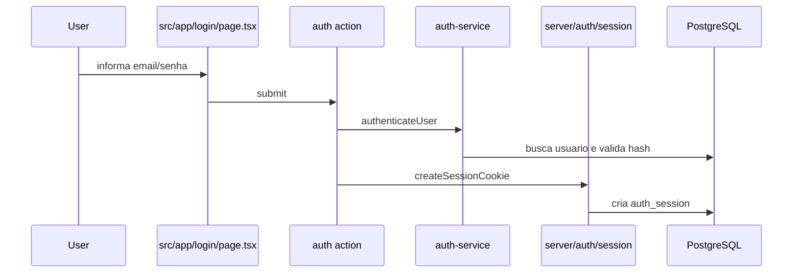
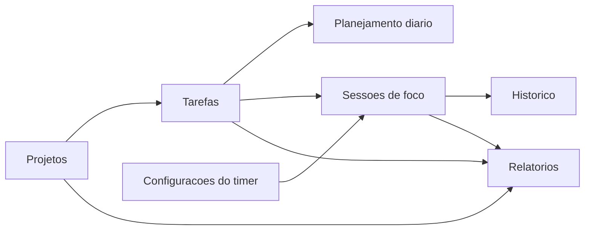

# Poplist - overview tecnico

Este documento resume a arquitetura atual do Poplist e como os modulos se relacionam. A ideia e servir como base para decidir os proximos passos de evolucao do produto e do codigo.

## Proposito

Poplist e uma aplicacao web de organizacao pessoal. O fluxo principal combina:

- projetos para agrupar trabalho;
- tarefas com status, prioridade, prazo e estimativa em pomodoros;
- planejamento diario;
- sessoes de foco vinculadas a tarefas;
- historico e relatorios de tempo focado;
- configuracoes do timer por usuario;
- autenticacao local simples.

## Stack atual

- Next.js 16 com App Router.
- React 19.
- TypeScript em modo strict.
- Tailwind CSS v4.
- Componentes estilo shadcn/ui em `src/components/ui`.
- PostgreSQL com Drizzle ORM.
- Vitest para testes unitarios, de services, repositories e componentes.
- Playwright para E2E.

## Visao em camadas



## Fluxo de dependencia

O fluxo dominante e:

```text
src/app/page-or-route
  -> src/features/<modulo>/components
  -> src/features/<modulo>/actions ou schemas
  -> src/server/services
  -> src/server/repositories
  -> src/server/db/client + src/server/db/schema
  -> PostgreSQL
```

Em leitura server-side, algumas paginas chamam services diretamente para montar a tela. Em escrita, componentes usam server actions nos modulos de feature, e essas actions validam input com schemas antes de chamar services.

## Modulos de produto

| Modulo | Responsabilidade | Pontos de integracao |
| --- | --- | --- |
| `auth` | Login, logout, sessao local e usuario de desenvolvimento. | `src/server/auth`, `auth-service`, cookie `poplist_session`. |
| `projects` | Criacao, edicao, listagem e arquivamento de projetos. | Tarefas e sessoes de foco podem referenciar projeto. |
| `tasks` | CRUD e transicoes de status de tarefas. | Projetos, planejamento diario e sessoes de foco dependem de tarefas. |
| `daily-plan` | Planejamento de tarefas por data, ordenacao e criacao rapida para o dia. | Usa tarefas existentes e pode criar nova tarefa via `tasks-service`. |
| `focus-sessions` | Inicio, pausa, retomada, conclusao e cancelamento de sessoes de foco. | Depende de tarefas, configuracoes de timer e historico/relatorios. |
| `history` | Consulta paginada e filtrada de sessoes de foco passadas. | Le dados de `focus_sessions`, tarefas e projetos. |
| `reports` | Metricas agregadas por periodo e projeto. | Usa sessoes de foco, tarefas e projetos. |
| `settings` | Configuracoes de duracao do foco e pausas. | Alimenta a duracao planejada de novas sessoes de foco. |

## Entidades e relacoes de dados



Observacoes importantes do schema:

- `tasks.project_id` usa `onDelete: set null`, preservando tarefas quando um projeto e removido.
- `focus_sessions.task_id` usa `onDelete: restrict`, evitando remover tarefa com sessao vinculada.
- Existe uma unique parcial para impedir mais de uma sessao `active` ou `paused` ao mesmo tempo.
- `timer_settings` e unico por usuario.
- `daily_plan_items` evita duplicar a mesma tarefa na mesma data.

## Fluxos principais

### Login e shell autenticado



O shell autenticado (`ServerAppShell`) chama `requireCurrentUser` e busca a sessao de foco ativa para renderizar o widget global.

### Tarefas, planejamento e foco



Esse e o nucleo do produto: projetos organizam tarefas; tarefas entram no planejamento diario; sessoes de foco registram execucao; historico e relatorios transformam execucao em leitura operacional.

## Contratos internos

### Pages

As paginas em `src/app/*/page.tsx` fazem composicao de tela, parse de search params e chamada a services para dados iniciais.

### Feature modules

Cada feature concentra:

- `components`: componentes especificos do dominio.
- `actions`: server actions para mutacoes.
- `schemas`: validacao e tipos de input derivados de Zod.

### Services

`src/server/services` concentra regras de negocio, validacao de estado e orquestracao entre repositories. Exemplos:

- `tasks-service`: cria, lista, edita e transiciona tarefas.
- `daily-plan-service`: monta o plano do dia e reordena itens.
- `focus-sessions-service`: controla maquina de estados de foco.
- `reports-service`: agrega metricas.
- `timer-settings-service`: aplica defaults e limites.

### Repositories

`src/server/repositories` concentra acesso ao banco via Drizzle. A camada de service deve preferir repositories em vez de consultar o banco diretamente, exceto em casos bem justificados de agregacao ou health check.

## Pontos de atencao para evolucao

1. Build estatico vs dados dinamicos

   O build atual falhou na fase de geracao de paginas estaticas. Como varias paginas acessam services e banco durante renderizacao, provavelmente sera necessario explicitar comportamento dinamico em rotas autenticadas ou revisar a estrategia de rendering/cache.

2. Testes dependem de PostgreSQL local

   Parte relevante da suite usa banco real e apaga tabelas no setup dos testes. Para evoluir com seguranca, vale isolar um banco de teste por execucao ou garantir `DATABASE_URL`/`E2E_DATABASE_URL` dedicados antes de rodar testes destrutivos.

3. Multiusuario parcial

   O schema tem `user_id` nas entidades principais e services usam `getServiceUserId`, mas algumas constraints ainda nao incluem `user_id`, como posicao do planejamento por data. Se o produto evoluir para multiusuario real, revisar unicidades e filtros por usuario.

4. Limite entre services e repositories

   A arquitetura ja aponta para separacao clara, mas `reports-service` faz queries agregadas diretamente no `db`. Isso pode ser aceitavel para leitura agregada, mas e um ponto a padronizar se relatorios crescerem.

5. Modelo de foco

   A regra de apenas uma sessao ativa/pausada e global no banco. Se no futuro houver multiusuario real, essa unique parcial deve ser revista para ser por usuario.

## Perguntas para decidir proximas fases

- O Poplist deve continuar como app pessoal local-first ou virar multiusuario completo?
- O foco principal da proxima fase e confiabilidade tecnica, UX do planejamento, relatorios ou autenticacao/deploy?
- Devemos priorizar corrigir `build` e isolamento dos testes antes de adicionar features?
- Relatorios devem continuar simples ou virar um modulo analitico mais forte?
- Planejamento diario deve evoluir para recorrencia, agenda/calendario ou apenas ordenacao manual?

## Sugestao de roadmap tecnico

1. Corrigir build das rotas autenticadas/dinamicas.
2. Isolar banco de testes para evitar risco de apagar dados locais.
3. Revisar constraints multiusuario (`daily_plan_items`, `focus_sessions_single_active_unique`).
4. Consolidar padrao de data fetching entre pages, services e actions.
5. Evoluir UX do planejamento diario e foco com base nos fluxos mais usados.
